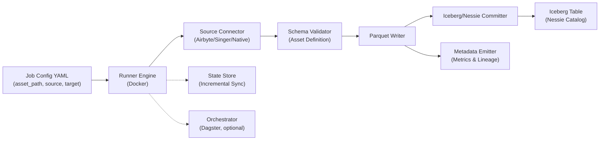

# Dativo Ingestion Platform

**Config-only ingestion engine for SaaS APIs and databases → Apache Iceberg data lakes.**

> **Note**: Dativo focuses on **ingestion + validation + write + commit** (Extract, Validate, Load). For data transformations, use your data lake's transformation layer (dbt, Spark, etc.) after ingestion.

## Why Dativo Exists

UI-driven ingestion tools break down in regulated, self-hosted, and governance-heavy environments. Click-through workflows cannot be version-controlled, audited, or enforced through policy-as-code. When compliance requires audit trails, change approvals, and repeatable deployments, point-and-click interfaces become liabilities—not assets.

Dativo is built on three principles: **config-only operation**, **specs-as-code**, and **tenant isolation**. Job config YAML files mean ingestion pipelines live in Git, pass through PR reviews, and integrate with existing IaC tooling. Asset definitions (specs-as-code) become versioned artifacts that map directly to data contracts. Tenant isolation isn't an afterthought—it's built into state management, secrets, and data paths from day one, enabling true multi-tenant SaaS platforms without cross-tenant leakage.

Finally, data remains fully in the customer's cloud. No data transits through third-party services. No hosted control planes touch your records. Everything runs in your infrastructure, on your terms—critical for enterprises that cannot send sensitive data through external pipelines or accept vendor lock-in.

## What It Is / What It Is Not

**Dativo Is:**
- ✅ Headless, config-driven ingestion (YAML-based, GitOps-friendly)
- ✅ Docker-deployed (runs in your infrastructure)
- ✅ Two execution modes: **oneshot** (single job, exits after completion) and **orchestrated** (Dagster, scheduled jobs) - see [docs/RUNNER_AND_ORCHESTRATION.md](docs/RUNNER_AND_ORCHESTRATION.md#execution-modes)
- ✅ Multi-tenant by design (required `tenant_id` in all job configs; per-tenant state, secrets, and data paths)
- ✅ Writes Parquet and commits to Iceberg via Nessie (see [docs/architecture.md](docs/architecture.md#icebergnessie-committer))
- ✅ Schema-enforced (asset definitions with strict/warn validation modes) - see [docs/SCHEMA_VALIDATION.md](docs/SCHEMA_VALIDATION.md)
- ✅ Extensible (Python and Rust plugins for custom logic) - see [docs/CUSTOM_PLUGINS.md](docs/CUSTOM_PLUGINS.md)

**Dativo Is Not:**
- ❌ A hosted SaaS control plane (runs in your infrastructure)
- ❌ A UI-first ingestion product (everything is config/CLI-based)
- ❌ A transformation tool (use dbt, Spark, etc. after ingestion)
- ❌ A BI tool (focuses on ingestion only)

## 5-Minute Quickstart

### Prerequisites
- Docker

### Oneshot Mode

Run a single ingestion job with Docker:

```bash
docker run --rm \
  -v $(pwd)/assets:/app/assets:ro \
  -v $(pwd)/configs:/app/configs \
  -v $(pwd)/connectors:/app/connectors:ro \
  -v $(pwd)/jobs:/app/jobs \
  -v $(pwd)/secrets:/app/secrets:ro \
  -v $(pwd)/state:/app/state \
  dativo:latest run --config /app/jobs/acme/stripe_customers_to_iceberg.yaml --mode self_hosted
```

**Job Config YAML** (`jobs/acme/stripe_customers_to_iceberg.yaml`):
```yaml
tenant_id: acme
environment: prod

# Source connector
source_connector: stripe
source_connector_path: /app/connectors/stripe.yaml

# Target connector
target_connector: iceberg
target_connector_path: /app/connectors/iceberg.yaml

# Asset definition (specs-as-code)
asset: stripe_customers
asset_path: /app/assets/stripe/v1.0/customers.yaml

# Source configuration
source:
  object: customers
  incremental:
    lookback_days: 1

# Target configuration
target:
  branch: acme
  warehouse: s3://lake/acme/
  connection:
    nessie:
      uri: "http://nessie.acme.internal:19120/api/v1"
    s3:
      bucket: "${S3_BUCKET}"
```

**Expected Output**: JSON logs showing job execution, extraction, validation, Parquet writing, Iceberg + Nessie commit, and completion.

**Exit Codes** (see [docs/RUNNER_AND_ORCHESTRATION.md](docs/RUNNER_AND_ORCHESTRATION.md#exit-codes)):
- `0`: Success - all records processed successfully
- `1`: Partial success - some records had errors (warn mode)
- `2`: Failure - job failed (validation errors in strict mode, or other errors)

**Volume Mounts:**
- `assets`: Asset definitions (specs-as-code, read-only, mounted to `/app/assets`)
- `configs`: Runner and policy configurations (mounted to `/app/configs`)
- `connectors`: Connector configuration files (read-only, mounted to `/app/connectors`)
- `secrets`: Secrets storage (read-only, tenant-organized, optional, mounted to `/app/secrets`)
- `state`: Incremental sync state (per tenant, mounted to `/app/state`)
- `logs`: Log files (optional, mounted to `/app/logs`)

### Orchestrated Mode (Dagster)

Start the orchestrator service for scheduled jobs:

```bash
docker run --rm -p 3000:3000 \
  -v $(pwd)/assets:/app/assets:ro \
  -v $(pwd)/configs:/app/configs \
  -v $(pwd)/connectors:/app/connectors:ro \
  -v $(pwd)/jobs:/app/jobs \
  -v $(pwd)/secrets:/app/secrets:ro \
  -v $(pwd)/state:/app/state \
  dativo:latest start orchestrated --runner-config /app/configs/runner.yaml
```

**Runner Configuration** (`configs/runner.yaml`):
```yaml
runner:
  mode: orchestrated
  orchestrator:
    type: dagster
    schedules:
      - name: stripe_customers_hourly
        config: /app/jobs/acme/stripe_customers_to_iceberg.yaml
        cron: "0 * * * *"
        enabled: true
        timezone: "UTC"
    concurrency_per_tenant: 1  # Exactly one job per tenant at a time (serial execution)
```

**Access Web UI**: `http://localhost:3000`

For detailed instructions, see [docs/quickstart.md](docs/quickstart.md) and [docs/RUNNER_AND_ORCHESTRATION.md](docs/RUNNER_AND_ORCHESTRATION.md).

## Validation & Dry-Run

Dativo provides CLI tools to validate configurations and test ingestion without writing data.

### Validate Configuration
Validate schema, connector references, and registry compatibility for a job configuration:

```bash
dativo validate config --path configs/jobs/stripe.yaml
```

By default, this validates against `self_hosted` mode restrictions. To validate for cloud deployment (which restricts certain connectors like PostgreSQL), use the `--mode` flag:

```bash
dativo validate config --path configs/jobs/stripe.yaml --mode cloud
```

### Validate Asset
Validate asset definition against ODCS + Dativo extensions:

```bash
dativo validate asset --path assets/stripe/v1.0/customers.yaml
```

### Dry Run
Perform discovery, schema negotiation, and fetch sample data (10-50 rows) without writing to storage:

```bash
dativo run --dry-run --config configs/jobs/stripe.yaml
```

This is useful for verifying connectivity and data shape before running production ingestion.

## Supported Connectors

Connectors are registered in `/registry/connectors.yaml`. Current connectors:

### Sources
- **Stripe** (`stripe`) - Objects: charges, customers, invoices
- **HubSpot** (`hubspot`) - Objects: contacts, deals, companies
- **Google Drive CSV** (`gdrive_csv`) - Object: file
- **Google Sheets** (`google_sheets`) - Object: sheet
- **CSV** (`csv`) - Object: file
- **PostgreSQL** (`postgres`) - Self-hosted only (`allowed_in_cloud: false`) ⚠️
- **MySQL** (`mysql`) - Self-hosted only (`allowed_in_cloud: false`) ⚠️
- **Mimesis** (`mimesis`) - Object: synthetic (testing)

### Targets
- **Iceberg** (`iceberg`) - Apache Iceberg tables (Parquet format)
- **S3** (`s3`) - Amazon S3 object storage
- **MinIO** (`minio`) - MinIO object storage (S3-compatible)

> **Note**: PostgreSQL and MySQL have `allowed_in_cloud: false` in the connector registry and cannot be used in cloud/SaaS deployments.

See [docs/connectors.md](docs/connectors.md) for the complete connector reference with capabilities and configuration examples.

## When to Choose Dativo

Choose Dativo when:
- **You need multi-tenant architecture**: Required `tenant_id` in all job configs; per-tenant state files (`state/{tenant_id}/`), secrets (`secrets/{tenant_id}/`), and data paths
- **You require GitOps/CI/CD integration**: All configurations are YAML files (job configs, asset definitions, runner configs) stored in version control
- **You're building on Apache Iceberg**: Commits Parquet files to Iceberg tables via Nessie catalog (see [docs/architecture.md](docs/architecture.md#icebergnessie-committer))
- **You need schema enforcement**: Asset definitions validated with strict/warn modes (see [docs/SCHEMA_VALIDATION.md](docs/SCHEMA_VALIDATION.md))
- **You want to use Airbyte connectors without the UI**: Dativo uses Airbyte connectors via `AirbyteExtractor` class (see [docs/architecture.md](docs/architecture.md#connector-plugin-wrapper))

## When to Choose Airbyte or Meltano

Choose Airbyte when:
- **You prefer UI-driven configuration**: Web-based setup and management
- **You need 300+ pre-built connectors**: Large connector ecosystem with minimal setup

Choose Meltano when:
- **You're already invested in Singer taps/targets**: Prefer the Singer ecosystem approach

See [docs/comparisons.md](docs/comparisons.md) for detailed feature comparisons and migration guidance.

## Documentation

- **[Documentation Index](docs/index.md)** - Complete documentation navigation and guide

**Essential Guides:**
- **[Runner and Orchestration](docs/RUNNER_AND_ORCHESTRATION.md)** - Oneshot and orchestrated execution modes
- **[Configuration Reference](docs/CONFIG_REFERENCE.md)** - Job config YAML and asset definitions (specs-as-code)
- **[Schema Validation](docs/SCHEMA_VALIDATION.md)** - Asset definition validation with registry AJV validation
- **[Connector Reference](docs/connectors.md)** - Connector registry (`/registry/connectors.yaml`) and capabilities

## Architecture

Dativo-ingest consists of the following components:

- **Runner engine (Docker)**: Executes job configs in stateless containers
- **Orchestrator (Dagster, optional/bundled)**: Schedules and manages job execution with `concurrency_per_tenant: 1` (serial execution per tenant)
- **Connector plugin wrapper**: Integrates Airbyte, Singer, and Meltano connectors
- **Schema validator**: Validates records against asset definitions (strict/warn modes)
- **Parquet writer**: Writes validated data to Parquet files with configurable sizing
- **Iceberg/Nessie committer**: Commits Parquet files to Iceberg tables via Nessie catalog
- **State store**: Manages incremental sync state per tenant
- **Metadata emitter**: Emits observability metrics (Prometheus, OpenTelemetry) and catalog lineage



**Design Principle: One Asset Per Job**

Each job configuration references exactly one asset definition (specs-as-code). This simplifies governance, enables per-asset scheduling, and ensures clear failure semantics. To process multiple assets, create separate job files and schedule them via the orchestrator (Dagster) in `runner.yaml`. 

**Concurrency**: Orchestrated mode enforces `concurrency_per_tenant: 1` (exactly one job per tenant at a time) to prevent Nessie commit conflicts. See [docs/RUNNER_AND_ORCHESTRATION.md](docs/RUNNER_AND_ORCHESTRATION.md#tenant-isolation) for details.

See [docs/architecture.md](docs/architecture.md) for detailed component descriptions and data flow.

## Directory Structure

The canonical directory structure follows this layout:

```
dativo-ingest/
├── assets/                 # Asset definitions (specs-as-code, read-only)
│   └── {source_type}/     # e.g., stripe, hubspot, csv
│       └── v{version}/    # e.g., v1.0, v1.1
│           └── {object}.yaml  # e.g., customers.yaml
├── configs/               # Runner and policy configurations
│   ├── runner.yaml        # Orchestrator schedules
│   └── policy.yaml        # Policy configurations
├── registry/              # Connector registry (capabilities)
│   └── connectors.yaml    # Connector type registry
├── jobs/                  # Job config YAML files (tenant-specific)
│   └── {tenant_id}/
│       └── {job_name}.yaml
├── connectors/            # Connector recipes (read-only, tenant-agnostic)
│   ├── sources/           # Source connector definitions
│   └── targets/           # Target connector definitions
├── secrets/               # Secrets storage (read-only, tenant-organized)
│   └── {tenant_id}/
│       ├── {connector}.env
│       └── {connector}.json
├── state/                 # Incremental sync state (per tenant)
│   └── {tenant_id}/
│       └── {job_name}.json
└── logs/                  # Log files (per tenant, optional)
    └── {tenant_id}/
        └── {job_name}.log
```

**Key Points:**
- **Asset definitions** (specs-as-code) are stored in `/assets/{source_type}/v{version}/` with semantic versioning
- **Job configs** reference asset definitions via `asset_path` (e.g., `/app/assets/stripe/v1.0/customers.yaml`)
- **Per-tenant organization** for `secrets/`, `state/`, and `logs/` directories
- **Connector registry** at `/registry/connectors.yaml` defines connector capabilities

See [docs/index.md](docs/index.md) for complete documentation, including detailed setup guides and configuration references.

## Contributing

We welcome contributions! Dativo-Ingest is open source and we're actively looking for contributors.

**Getting Started:**
- Read [Contributing Guide](.github/CONTRIBUTING.md) for development setup and guidelines
- Check [Code of Conduct](CODE_OF_CONDUCT.md) for community standards
- See [Security Policy](SECURITY.md) for reporting security issues
- Review [Roadmap](docs/roadmap.md) for planned features

**Ways to Contribute:**
- 🐛 Report bugs via [GitHub Issues](https://github.com/dativo-io/dativo-ingest/issues)
- 💡 Suggest features via [GitHub Discussions](https://github.com/dativo-io/dativo-ingest/discussions)
- 📝 Improve documentation
- 🔌 Add new connectors or plugins
- 🧪 Write tests
- 📖 Review pull requests

**Good First Issues:** Look for issues labeled `good first issue` – these are great entry points for new contributors!

## License

Apache License 2.0 - See [LICENSE](LICENSE) file for details.
