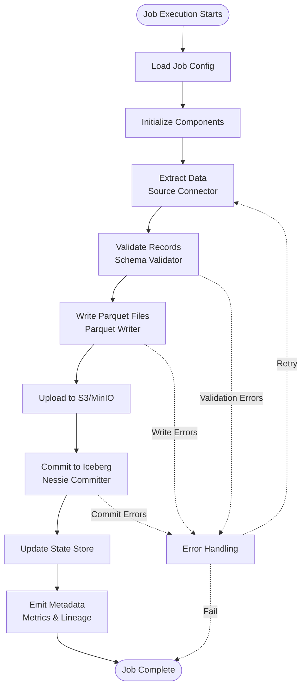

# Architecture Overview

This document describes the components and architecture of the Dativo ingestion platform.

## Components

### Runner Engine (Docker)

The runner engine executes job configurations in stateless Docker containers. It supports two execution modes:

- **Oneshot Mode**: Runs a single job and exits
- **Orchestrated Mode**: Long-running service that executes scheduled jobs

The runner engine:
- Loads job configuration from YAML files
- Validates configuration against schemas
- Initializes components (extractors, validators, writers, committers)
- Coordinates the execution pipeline
- Manages error handling and exit codes
- Supports Docker-based deployment

See [Runner and Orchestration](RUNNER_AND_ORCHESTRATION.md) for execution mode details.

### Orchestrator (Dagster, Optional/Bundled)

The orchestrator manages job scheduling and execution:

- **Dagster Integration**: Lightweight Dagster instance bundled in orchestrated mode
- **Schedule Management**: Reads schedules from `runner.yaml` with cron expressions
- **Tenant Serialization**: Ensures serial execution per tenant to prevent Nessie commit conflicts
- **Web UI**: Provides monitoring interface on port 3000 (default)
- **Retry Policies**: Automatic retry with exponential backoff

**Configuration:**
```yaml
runner:
  mode: orchestrated
  orchestrator:
    type: dagster
    schedules:
      - name: stripe_customers_hourly
        config: /app/jobs/acme/stripe_customers.yaml
        cron: "0 * * * *"
    concurrency_per_tenant: 1
```

See [Runner and Orchestration](RUNNER_AND_ORCHESTRATION.md) for complete orchestration details.

### Connector Plugin Wrapper

Wraps external connector frameworks to provide a unified interface:

- **Airbyte Connectors**: Executes Airbyte connector Docker containers, streams JSON output
- **Singer Taps/Targets**: Supports Singer protocol connectors
- **Meltano Integration**: Uses Meltano for tap/target execution
- **Native Connectors**: Python-based implementations for CSV, databases, etc.

The wrapper:
- Manages Docker container lifecycle (for Airbyte connectors)
- Streams data via stdout/stdin (for external connectors)
- Handles protocol conversion (Airbyte JSON → Python dictionaries)
- Provides unified `extract()` interface returning Python iterators

See [Data Flow Architecture](../DATA_FLOW_ARCHITECTURE.md) for connector data flow details.

### Schema Validator

Validates records against asset definitions (specs-as-code):

- **Asset Definitions**: ODCS v3.0.2 compliant schema definitions
- **Validation Modes**:
  - **Strict**: Fails job if any record violates schema
  - **Warn**: Logs validation errors but continues processing
- **Field Validation**: Type checking, required fields, format validation
- **Batch Processing**: Validates records in batches for efficiency

**Configuration:**
```yaml
schema_validation_mode: strict  # or warn
```

The validator:
- Loads asset definition from `asset_path`
- Validates each record against schema
- Returns valid records and error lists
- Integrates with logging for validation errors

See [Schema Validation](SCHEMA_VALIDATION.md) for complete validation details.

### Parquet Writer

Writes validated records to Parquet files:

- **File Sizing**: Target size of 128-200 MB (configurable)
- **Batch Writing**: Writes records in batches to approximate target size
- **Compression**: Snappy compression (default)
- **Schema Mapping**: Converts asset definition schema to Parquet schema
- **Custom Writers**: Supports Python and Rust plugin writers for performance

**Configuration:**
```yaml
target:
  parquet_target_size_mb: 150  # Target file size in MB
```

The writer:
- Estimates file size based on sample records
- Batches records to approximate target size
- Writes files when batch size is reached
- Returns file metadata (path, size, record count)

See [Ingestion Execution](INGESTION_EXECUTION.md#parquet-file-writing) for writing details.

### Iceberg/Nessie Committer

Commits Parquet files to Iceberg tables via Nessie catalog:

- **Nessie Integration**: Git-like versioning for Iceberg tables
- **Branch Management**: Commits to tenant-specific branches
- **Table Creation**: Automatically creates tables if they don't exist
- **Schema Evolution**: Supports schema changes between runs
- **Metadata Tagging**: Applies governance tags and FinOps metadata

**Configuration:**
```yaml
target:
  branch: acme  # Defaults to tenant_id
  warehouse: s3://lake/acme/
  connection:
    nessie:
      uri: "http://nessie.acme.internal:19120/api/v1"
    s3:
      bucket: "acme-data-lake"
```

The committer:
- Uploads Parquet files to S3/MinIO storage
- Registers files in Iceberg table metadata
- Commits metadata changes to Nessie branch
- Returns commit ID and file count

**Note**: Serial execution per tenant (`concurrency_per_tenant: 1`) prevents Nessie commit conflicts.

See [Ingestion Execution](INGESTION_EXECUTION.md#icebergnessie-integration) for commit process details.

### State Store

Manages incremental sync state per tenant:

- **State Files**: Stored per tenant in `state/{tenant_id}/`
- **Incremental Tracking**: Tracks cursor values for incremental syncs
- **State Persistence**: JSON files for state storage
- **Checkpoint Recovery**: Supports resuming from checkpoints

The state store:
- Reads incremental state before extraction
- Updates state after successful commits
- Supports lookback windows for incremental strategies
- Tenant-isolated state files

See [Ingestion Execution](INGESTION_EXECUTION.md#incremental-syncs) for state management details.

### Metadata Emitter

Emits observability metrics and catalog lineage:

- **Prometheus Metrics**: Job execution metrics (records, bytes, duration, retries)
- **OpenTelemetry**: Distributed tracing and metrics export
- **Catalog Lineage**: Pushes lineage to OpenMetadata, Glue, Unity Catalog, Nessie
- **Structured Logging**: JSON logs with event types and context

**Configuration:**
```yaml
# Runner config
metrics:
  prometheus:
    enabled: true
    port: 9400

# Job config
catalog:
  type: openmetadata
  connection:
    api_url: "http://localhost:8585/api"
  push_lineage: true
  push_metadata: true
```

The emitter:
- Collects metrics during job execution
- Exports to Prometheus (orchestrated mode) or logs (oneshot mode)
- Pushes lineage and metadata to catalogs
- Never blocks job execution (graceful degradation)

See [Observability Metrics](OBSERVABILITY_METRICS.md) and [Catalog Integration](CATALOG_INTEGRATION.md) for details.

## Data Flow

The complete data flow from source to target:

1. **Job Config Load**: Runner engine loads job configuration YAML
2. **Component Initialization**: Initializes extractor, validator, writer, committer
3. **Data Extraction**: Source connector extracts data in batches
4. **Schema Validation**: Validator validates each batch against asset definition
5. **Parquet Writing**: Writer converts validated records to Parquet files
6. **Iceberg Commit**: Committer uploads files and commits to Nessie
7. **State Update**: State store updates incremental sync state
8. **Metadata Emission**: Metrics and lineage pushed to observability systems



## Execution Modes

### Oneshot Mode

- Single job execution
- No orchestration overhead
- Ideal for manual runs, testing, CI/CD
- Metrics logged only (no Prometheus server)

### Orchestrated Mode

- Long-running service
- Dagster schedules jobs
- Serial execution per tenant
- Prometheus metrics endpoint
- Web UI for monitoring

See [Runner and Orchestration](RUNNER_AND_ORCHESTRATION.md) for execution mode details.

## Multi-Tenancy

All components support tenant isolation:

- **State Store**: Per-tenant state files (`state/{tenant_id}/`)
- **Iceberg Committer**: Tenant-specific branches and table names
- **Metadata Emitter**: Tenant tags in metrics and lineage
- **Orchestrator**: Serial execution per tenant prevents conflicts

See [Design: One Asset Per Job](design/one-asset-per-job.md) for multi-tenancy design details.

## Related Documentation

- [Data Flow Architecture](../DATA_FLOW_ARCHITECTURE.md) - Detailed data flow from reader to writer
- [Ingestion Execution](INGESTION_EXECUTION.md) - Complete execution flow and phases
- [Runner and Orchestration](RUNNER_AND_ORCHESTRATION.md) - Orchestration and scheduling
- [Schema Validation](SCHEMA_VALIDATION.md) - Validation rules and modes
- [Observability Metrics](OBSERVABILITY_METRICS.md) - Metrics collection and export
- [Catalog Integration](CATALOG_INTEGRATION.md) - Catalog integration details

